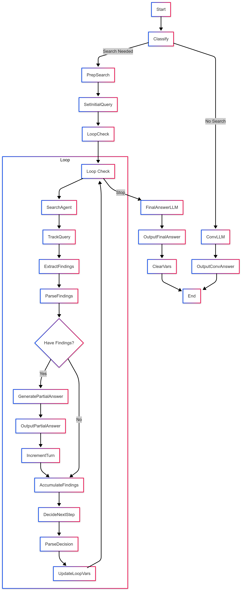

# Deep Research Replication with Dify

This project demonstrates a simplified replication of the "Deep Research" concept using the [Dify](https://github.com/langgenius/dify) platform.

It leverages Dify's newly released **Agent node** and **Loop node** features, incorporating ideas similar to Anthropic's ["Think Tool"](https://www.anthropic.com/engineering/claude-think-tool) concept, to create a workflow that performs iterative searches and analysis to answer user queries comprehensively.

The workflow is defined in the `DeepResearch.yml` file and can be imported directly into your Dify workspace.

## Workflow Logic

The core logic of the Deep Research agent is visualized below:

